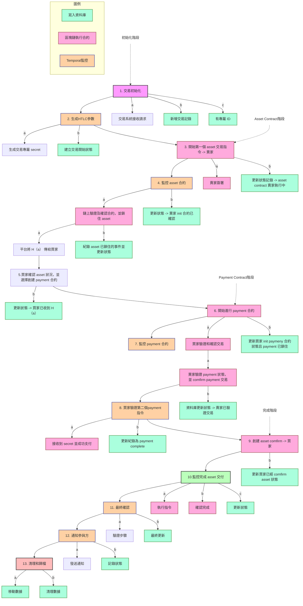

# HTLC 監控系統

這個專案使用 Temporal 工作流引擎來監控以太坊網絡上的 HTLC (Hash Time-Locked Contract) 交易事件。

## 前置需求

- Go 1.16 或更高版本
- Docker 和 Docker Compose (用於運行 Temporal 服務器)
- 以太坊節點訪問 (本例中使用 Sepolia 測試網絡)

## 專案結構
```
HTLC-monitor/
├── cmd/
│   ├── worker/
│   │   └── main.go
│   └── starter/
│       └── main.go
├── internal/
│   ├── workflow/
│   │   └── workflow.go
│   └── activity/
│       └── activity.go
├── go.sum 
└── go.mod

```

## 設置步驟

1. git clone repo:
```sh
git clone [你的存儲庫 URL]
cd HTLC-monitor
```

2. 安裝依賴:
```sh
go mod tidy
```
3. 啟動 Temporal 服務器:
```sh
cd docker-compose
docker-compose up -d
```
4. 在 `internal/activity/activity.go` 中更新 Sepolia 測試網絡 RPC 端點:
```go
client, err := ethclient.Dial("https://rpc.sepolia.org")
```
## 運行系統
0. 換到 HTLC-monitor 資料夾
```sh
cd HTLC-monitor
```
1. 在一個終端中啟動 worker:
```go
go run cmd/worker/main.go
```

2. 在另一個終端中啟動工作流:
```go
go run cmd/starter/main.go
```

## 監控和管理

訪問 Temporal Web UI: http://localhost:8080
在 UI 中，你可以查看工作流狀態、歷史和日誌
或透過 CLI 也可以看到回吐的 `log` 資訊

## 主要程式碼

1. Workflow ( `internal/workflow/workflow.go` ):

- 定義了 `HTLCMonitorWorkflow` 函數
- 處理活動的執行和錯誤重試


2. Activity ( `internal/activity/activity.go` ):

- 定義了 `MonitorContractActivity` 函數
- 實現了 HTLC 合約的監控邏輯


3. Worker ( `cmd/worker/main.go` ):

- 設置和運行 Temporal `worker`
- 註冊工作流和活動


4. Starter ( `cmd/starter/main.go` ):

- 啟動 HTLC 監控工作流


## HTLC 交易流程


## 故障排除

1. 如果 UI 顯示工作流已終止，但 CLI 仍在運行:

- 檢查 `MonitorContractActivity` 中的取消處理邏輯
- 確保活動正確響應 `ctx.Done()` 信號


2. 如果看不到詳細日誌:

- 使用 `activity.GetLogger(ctx)` 進行日誌記錄
- 調整 `worker` 的日誌級別


3. 如果活動持續失敗:

- 檢查 `Sepolia` 測試網絡 `RPC 端點` 的可用性
- 查看 `Temporal UI` 中的錯誤消息


## 擴展建議

1. 添加數據持久化:

- 將監控到的 HTLC 事件保存到數據庫中


2. 實現通知系統:

- 為關鍵 HTLC 階段添加警報功能


3. 優化性能:

- 調整輪詢間隔
- 實現更高效的事件過濾機制


4. 增加測試覆蓋:

- 為工作流和活動添加單元測試
- 使用 Temporal 的測試框架進行集成測試


5. 添加更多 HTLC 特定功能:

- 實現超時監控和自動退款機制
- 添加多鏈支持，擴展到其他支持 HTLC 的區塊鏈